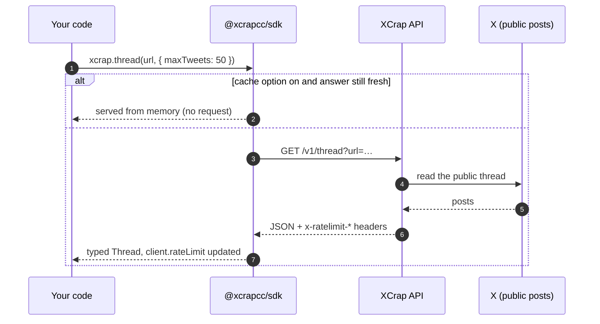
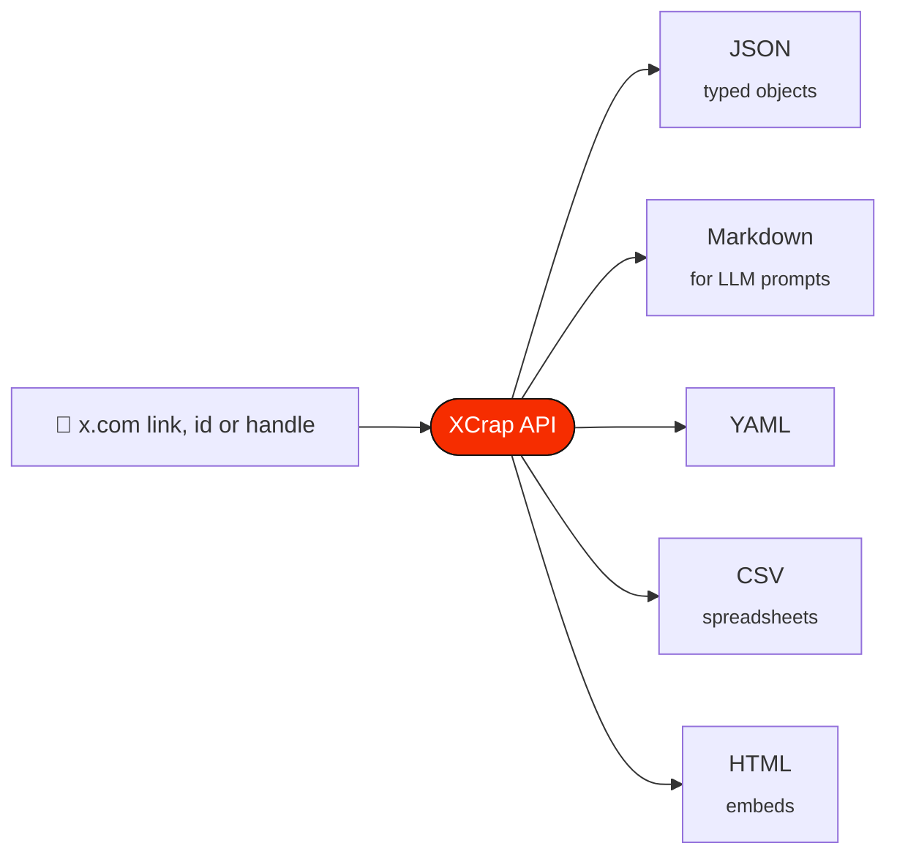
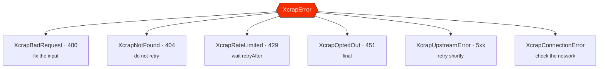

<p align="center">
  <a href="https://xcrap.cc"></a>
</p>

<p align="center">
  <a href="https://www.npmjs.com/package/@xcrapcc/sdk"></a>
  <a href="https://xcrap.cc/docs"></a>
  <a href="https://github.com/XcrapCC/xcrap-node/blob/main/index.d.ts"></a>
  
  <a href="https://github.com/XcrapCC/xcrap-node/blob/main/LICENSE"></a>
  <a href="https://github.com/XcrapCC/xcrap-node"></a>
</p>

<p align="center">
  <b>X (Twitter) posts, threads, profiles, search and media — as typed JSON, or Markdown you can paste straight into a model.</b><br>
  <sub>No signup · no OAuth · no bearer token · construct and call</sub>
</p>

<p align="center">
  <a href="https://xcrap.cc">Website</a> ·
  <a href="https://xcrap.cc/docs">API reference</a> ·
  <a href="https://xcrap.cc/sdk/node">SDK guide</a> ·
  <a href="https://github.com/XcrapCC/xcrap-node/tree/main/examples">Examples</a> ·
  <a href="https://github.com/XcrapCC/xcrap-python">Python SDK</a> ·
  <a href="https://github.com/XcrapCC/Xcrap-mcp">MCP server</a>
</p>

---

> [!NOTE]
> **Always in step with the API.** Every time an XCrap endpoint is added or changed, this SDK is updated and released with it, so the methods and types here always match what the API returns.

## Contents

- [Why this SDK](#why-this-sdk)
- [Install](#install)
- [How it works](#how-it-works)
- [Quick start](#quick-start)
- [Recipes](#recipes)
- [What's new in 1.3.0](#whats-new-in-130) · [1.2.0](#whats-new-in-120)
- [API](#api) — [options](#new-xcrapoptions) · [methods](#methods) · [client state](#client-state) · [errors](#errors)
- [Rate limits](#rate-limits)
- [Examples](#examples)
- [Tests](#tests)
- [Related repositories](#related-repositories)

## Why this SDK

| | |
| --- | --- |
| 🔑 **No API key** | No signup, no OAuth, no bearer token. `new Xcrap()` and you are reading. |
| 📦 **Zero runtime dependencies** | Built-in `fetch`, Node 18 or newer. |
| 🧩 **Typed** | Full `.d.ts` declarations for every method and every response shape. |
| 📝 **Markdown-first** | `{ markdown: true }` on every read method, with a token estimate in `client.lastMeta.markdownTokens`. |
| 🧠 **Optional response cache** | `new Xcrap({ cache: 60_000 })` keeps answers in memory, so repeats cost no request. |
| 🔁 **Paging built in** | Cursors in hand, or `userTweetsIterator()` walks the pages for you. |
| 🚦 **Rate-limit aware** | `client.rateLimit` after every call, and a typed `XcrapRateLimited` with `retryAfter`. |

## Install

```bash
npm install @xcrapcc/sdk
```

<details>
<summary>Other package managers</summary>

```bash
pnpm add @xcrapcc/sdk
yarn add @xcrapcc/sdk
bun add @xcrapcc/sdk
```

</details>

```js
import { Xcrap } from '@xcrapcc/sdk';

const xcrap = new Xcrap(); // talks to https://xcrap.cc
```

## How it works



Pick the shape you need with `format` — JSON comes back parsed, everything else as a string:



## Quick start

```js
import { Xcrap } from '@xcrapcc/sdk';

const xcrap = new Xcrap();
const tweet = await xcrap.tweet('https://x.com/jack/status/20');

console.log(tweet.text);                    // just setting up my twttr
console.log(tweet.author.screen_name);      // jack
console.log(tweet.metrics.likes);           // 308067
```

A bare id works too: `await xcrap.tweet('20')`.

## Recipes

<details open>
<summary><b>📝 Feed a post to an LLM as Markdown</b></summary>

```js
const xcrap = new Xcrap();
const markdown = await xcrap.tweet('https://x.com/jack/status/20', { markdown: true });

console.log(markdown);
console.log(`~${xcrap.lastMeta.markdownTokens} tokens`); // budget your context window
```

Every read method takes `{ markdown: true }`, or `{ format: 'json' | 'markdown' | 'yaml' | 'csv' | 'html' }` when you want something else. JSON comes back parsed; everything else comes back as a string.

</details>

<details>
<summary><b>🧵 Unroll a thread and print it</b></summary>

```js
const xcrap = new Xcrap();
const thread = await xcrap.thread('https://x.com/naval/status/1002103360646823936', {
  maxTweets: 50,
});

console.log(`@${thread.author.screen_name} — ${thread.count} posts`);
for (const [index, post] of thread.tweets.entries()) {
  console.log(`${index + 1}. ${post.text}`);
}
if (thread.truncated) console.log('…thread was longer than maxTweets');
```

</details>

<details>
<summary><b>📜 Page an account's timeline</b></summary>

```js
const xcrap = new Xcrap();

// One page at a time, cursor in hand:
let page = await xcrap.userTweets('nasa', { count: 20, excludeReplies: true });
while (page.next_cursor) {
  console.log(page.tweets.map((t) => t.text));
  page = await xcrap.userTweets('nasa', { count: 20, cursor: page.next_cursor });
}

// Or let the SDK walk the pages for you:
for await (const post of xcrap.userTweetsIterator('nasa', { count: 20, limit: 100 })) {
  console.log(post.created_at, post.text.slice(0, 60));
}
```

</details>

<details>
<summary><b>🗂️ Export an account's history (with reposts)</b></summary>

```js
const xcrap = new Xcrap();
const history = await xcrap.userHistory('naval', {
  maxPosts: 500,
  since: '2025-01-01',
  includeReposts: true,
});

console.log(`${history.count} posts, ${history.oldest} → ${history.newest}`);
console.log(`stopped because: ${history.stop_reason}`); // max_posts | window | end_of_timeline | page_limit | upstream_error
```

</details>

<details>
<summary><b>🔎 Search with X's own operators</b></summary>

```js
const xcrap = new Xcrap();
const result = await xcrap.search('from:nasa mars', { feed: 'top', since: '2025-01-01' });

for (const post of result.tweets) console.log(post.text);
if (result.next_cursor) {
  const more = await xcrap.search('from:nasa mars', { feed: 'top', cursor: result.next_cursor });
}
```

`feed` is `latest` (default), `top`, `photos` or `videos`.

</details>

<details>
<summary><b>🖼️ Download media</b></summary>

```js
import { writeFile } from 'node:fs/promises';
import { Xcrap } from '@xcrapcc/sdk';

const xcrap = new Xcrap();
const url = 'https://x.com/NASA/status/1793412932641689801';

const listing = await xcrap.media(url);
console.log(`${listing.count} attachment(s)`);

for (const item of listing.media) {
  const file = await xcrap.downloadMedia(url, { index: item.index, quality: 'best' });
  await writeFile(file.filename, file.bytes);
  console.log(`saved ${file.filename} (${file.contentType}, ${file.contentLength} bytes)`);
}
```

</details>

<details>
<summary><b>📦 Resolve fifty posts in one call</b></summary>

```js
const xcrap = new Xcrap();
const result = await xcrap.bulk([
  'https://x.com/jack/status/20',
  'https://x.com/nasa/status/1',
  '1849565662058590299',
]);

console.log(`${result.succeeded} ok, ${result.failed} failed`);
for (const item of result.results) {
  if (item.ok) console.log('✓', item.tweet.text);
  else console.log('✗', item.input, item.error.message);
}
```

Bulk takes at most 50 URLs and never fails the whole batch for one bad link.

</details>

<details>
<summary><b>🚨 Handle errors by type</b></summary>

```js
import {
  Xcrap,
  XcrapNotFound,
  XcrapRateLimited,
  XcrapOptedOut,
  XcrapUpstreamError,
  XcrapBadRequest,
} from '@xcrapcc/sdk';

const xcrap = new Xcrap();

try {
  const tweet = await xcrap.tweet(process.argv[2]);
  console.log(tweet.text);
} catch (error) {
  if (error instanceof XcrapNotFound)        console.error('Gone for good:', error.message);
  else if (error instanceof XcrapRateLimited) console.error(`Wait ${error.retryAfter}s`);
  else if (error instanceof XcrapOptedOut)    console.error('Account opted out — do not retry');
  else if (error instanceof XcrapUpstreamError) console.error('Transient, retry in a minute');
  else if (error instanceof XcrapBadRequest)  console.error('Fix the input:', error.hint);
  else throw error;
}
```

Every message ends with the action that resolves it, so it is safe to surface directly to a user or an agent.

</details>

<details>
<summary><b>🚦 Watch your rate-limit budget</b></summary>

```js
const xcrap = new Xcrap();
await xcrap.trends({ count: 10 });

const { limit, remaining, resetAt } = xcrap.rateLimit;
console.log(`${remaining}/${limit} left, window resets at ${resetAt.toISOString()}`);

if (remaining < 5) {
  await new Promise((r) => setTimeout(r, resetAt - Date.now()));
}
```

</details>

## What's new in 1.3.0

| | |
| --- | --- |
| 🪦 **Why a post is gone** | `XcrapNotFound` carries `reason`: `post_deleted`, `author_protected`, `author_suspended`, `withheld`, `removed_by_x`, `age_restricted`, or `unavailable` when X does not say. |
| 🏷️ **`visibility`** | A post X has restricted carries X's own notice, whether X shows it less widely, and which actions X turned off. `null` on ordinary posts. |
| 📐 **`signals`** | `tweet(url, { signals: true })` adds the post's age, whether it is inside For You's 48-hour window, whether the author may qualify for X's new-author slot, and engagement ratios. Facts from public data, not a ranking score. |

```js
try {
  await xcrap.tweet('https://x.com/someone/status/2101177906030399610');
} catch (error) {
  if (error instanceof XcrapNotFound) console.log(error.reason); // post_deleted
}

const { signals } = await xcrap.tweet('20', { signals: true });
console.log(signals.in_for_you_window); // false
```

## What's new in 1.2.0

| | |
| --- | --- |
| 🧠 **In-memory response cache** | `new Xcrap({ cache: 60_000 })` keeps successful GET responses for that many **milliseconds**. A repeat costs no request and no rate limit. `fresh: true` always skips it; `clearCache()` empties it. |
| 🔁 **`includeReposts`** | `userHistory(handle, { includeReposts: true })` also returns the posts the account reposted. |
| 🛑 **`stop_reason`** | History responses say why the walk stopped: `max_posts`, `window`, `end_of_timeline`, `page_limit` or `upstream_error` (the posts collected until then are still returned). |

```js
const xcrap = new Xcrap({ cache: 60_000 }); // one minute

await xcrap.user('nasa'); // one request
await xcrap.user('nasa'); // answered from memory
xcrap.clearCache();
```

## API

### `new Xcrap(options?)`

| option       | default              | meaning                                                        |
| ------------ | -------------------- | -------------------------------------------------------------- |
| `baseUrl`    | `https://xcrap.cc`   | API origin. Leave it; change it only to route through a proxy you control |
| `timeout`    | `30000`              | Per-request timeout, ms                                        |
| `retries`    | `1`                  | Retries on 502/503/504 and transport errors                    |
| `retryDelay` | `500`                | Backoff before the retry, ms                                   |
| `cache`      | `0`                  | Keep successful GET responses in memory this many ms; `0` is off |
| `userAgent`  | `xcrap-node-sdk/…`   | Replaces the default descriptive agent                         |
| `headers`    | `{}`                 | Extra headers on every request                                 |
| `fetch`      | `globalThis.fetch`   | Inject a fetch implementation                                  |

> [!IMPORTANT]
> A 4xx is **never** retried. Fix the input (400), give up (404, 451), or wait out the window (429).

### Methods

| method                                       | endpoint             | returns                             |
| -------------------------------------------- | -------------------- | ----------------------------------- |
| `tweet(url, options?)`                        | `/v1/tweet`          | `Tweet`                             |
| `thread(url, options?)`                       | `/v1/thread`         | `Thread` (`options.maxTweets`, 1–100) |
| `user(handle, options?)`                      | `/v1/user`           | `User`                              |
| `userTweets(handle, options?)`                | `/v1/user/tweets`    | `Timeline` (`count`, `cursor`, `excludeReplies`, `mediaOnly`) |
| `userTweetsIterator(handle, options?)`        | `/v1/user/tweets`    | `AsyncGenerator<Tweet>` (`limit`)   |
| `userHistory(handle, options?)`               | `/v1/user/history`   | `AccountHistory` (`maxPosts` 1–1000, `since`, `until`, `includeReplies`, `includeReposts`) |
| `search(query, options?)`                     | `/v1/search`         | `SearchResult` (`feed`, `since`, `until`, `cursor`) |
| `replies(url, options?)`                      | `/v1/replies`        | `Replies` (`sort`: `top` or `recent`) |
| `followers(handle, options?)`                 | `/v1/user/followers` | `UserList` (`cursor`)               |
| `following(handle, options?)`                 | `/v1/user/following` | `UserList` (`cursor`)               |
| `trends(options?)`                            | `/v1/trends`         | `TrendsResult` (`count`, 1–50)      |
| `media(url, options?)`                        | `/v1/media`          | `MediaList`                         |
| `downloadMedia(url, options?)`                | `/v1/media/download` | `{filename, contentType, contentLength, bytes}` (`index`, `quality`) |
| `bulk(urls, options?)`                        | `/v1/bulk`           | `BulkResult` (≤ 50 urls, `method`)  |
| `clearCache()`                                | —                    | empties the in-memory response cache |

Every read method accepts `{ markdown, format, fresh, signal }`. `fresh: true` bypasses both the server's five-day cache and the client cache.

### Client state

- `client.rateLimit` — `{ limit, remaining, reset, resetAt }` from the last response.
- `client.lastMeta` — `{ format, cache, markdownTokens }` from the last response.

### Errors

| class                  | status | when                                                |
| ---------------------- | ------ | --------------------------------------------------- |
| `XcrapBadRequest`      | 400    | missing or unparseable parameter                     |
| `XcrapNotFound`        | 404    | deleted, suspended, private or nonexistent           |
| `XcrapRateLimited`     | 429    | budget spent — carries `retryAfter`, `resetAt`, `budget` |
| `XcrapOptedOut`        | 451    | the account opted out of XCrap                       |
| `XcrapUpstreamError`   | 5xx    | X could not be reached or timed out; usually transient |
| `XcrapConnectionError` | —      | DNS, TLS, socket or timeout failure                  |
| `XcrapError`           | —      | base class for all of the above                      |



## Rate limits

Budgets are per endpoint, per IP, and every response carries `x-ratelimit-limit` / `-remaining` / `-reset`.

| endpoint                                   | method(s)                                | budget                          |
| ------------------------------------------ | ---------------------------------------- | ------------------------------- |
| `/v1/tweet`                                | `tweet`                                  | 45 / minute                     |
| `/v1/user`                                 | `user`                                   | 45 / minute                     |
| `/v1/thread`                               | `thread`                                 | 15 / minute                     |
| `/v1/user/tweets`                          | `userTweets`, `userTweetsIterator`       | 15 / minute                     |
| `/v1/user/followers`, `/v1/user/following` | `followers`, `following`                 | 15 / minute                     |
| `/v1/replies`                              | `replies`                                | 15 / minute                     |
| `/v1/user/history`                         | `userHistory`                            | 4 / 5 minutes                   |
| `/v1/search`                               | `search`                                 | 10 / 15 minutes                 |
| `/v1/bulk`                                 | `bulk`                                   | 6 / 5 minutes (up to 50 posts each) |
| `/v1/media`, `/v1/media/download`          | `media`, `downloadMedia`                 | 20 / minute                     |
| `/v1/trends`                               | `trends`                                 | 90 / minute                     |

> [!TIP]
> Turn on `cache` to stop spending budget on repeats, and prefer one `bulk()` over many `tweet()` calls.

> [!IMPORTANT]
> **Need more headroom?** The [Enterprise plan](https://xcrap.cc/enterprise) offers higher rate limits, dedicated capacity, custom endpoints and formats, priority support, and invoices or agreements — with the same rules (public accounts only). Write to **[hello@xcrap.cc](mailto:hello@xcrap.cc)**.

## Examples

Small, runnable projects live in [`examples/`](https://github.com/XcrapCC/xcrap-node/tree/main/examples/). Each works as soon as you install it — there is no key to set up.

| Example | What it does | Extra dependency |
| --- | --- | --- |
| 💻 [`cli/`](https://github.com/XcrapCC/xcrap-node/tree/main/examples/cli/) | `xcrap-cli tweet`, `thread`, `user`, `search` and `history` from your terminal, saving to CSV, Markdown or JSON | none |
| 🎮 [`discord-bot/`](https://github.com/XcrapCC/xcrap-node/tree/main/examples/discord-bot/) | Turns X links into clean embeds and sends `!thread` as a Markdown file | `discord.js` v14 |
| ✈️ [`telegram-bot/`](https://github.com/XcrapCC/xcrap-node/tree/main/examples/telegram-bot/) | `/tweet`, `/thread` and automatic link expansion | `grammy` |
| 🗄️ [`thread-archiver/`](https://github.com/XcrapCC/xcrap-node/tree/main/examples/thread-archiver/) | Saves a list of threads to `archive/<handle>-<id>.md`, waiting out rate limits | none |
| 🤖 [`ai-summary/`](https://github.com/XcrapCC/xcrap-node/tree/main/examples/ai-summary/) | Builds a ready-to-send summary prompt from a thread, for any LLM | none |

```bash
cd examples/cli
npm install
node xcrap-cli.js tweet https://x.com/jack/status/20
```

Stop a running bot with <kbd>Ctrl</kbd> + <kbd>C</kbd>.

## Tests

```bash
node --test test.js
```

The suite is an integration smoke test: it talks to the live API, because that is the only thing that proves the client and the API still agree.

## Related repositories

| Repository | What it is |
| --- | --- |
| 🐍 [**xcrap-python**](https://github.com/XcrapCC/xcrap-python) | The Python SDK — `pip install xcrap-sdk` |
| 🤖 [**Xcrap-mcp**](https://github.com/XcrapCC/Xcrap-mcp) | The MCP server for Claude, Cursor and other agents — `npx -y @xcrapcc/mcp` |
| 📖 [**xcrap-docs**](https://github.com/XcrapCC/xcrap-docs) | Guides, API reference, OpenAPI 3.1, `llms.txt` and `skills.md` |
| 🏠 [**XcrapCC**](https://github.com/XcrapCC) | Everything XCrap on GitHub |

---

<p align="center">
  <a href="https://xcrap.cc"><b>xcrap.cc</b></a> · <a href="https://xcrap.cc/docs">Docs</a> · <a href="https://xcrap.cc/openapi.json">OpenAPI</a> · <a href="https://xcrap.cc/llms.txt">llms.txt</a> · <a href="https://xcrap.cc/skills.md">skills.md</a><br>
  <sub>MIT licensed · Public data only · Not affiliated with X Corp.</sub>
</p>
